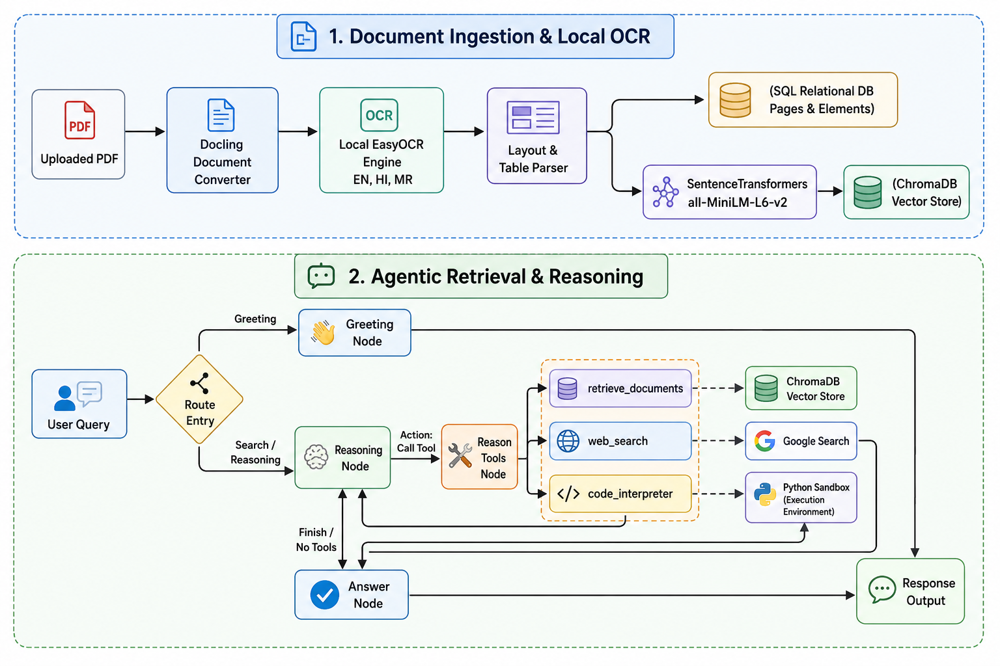

# MultiModal Document Intelligence

An end-to-end platform for intelligent document ingestion, structural analysis, layout-aware OCR, and agentic retrieval-augmented generation (RAG). 

The platform allows users to upload documents under projects, automatically parsing them using local deep learning models, storing structure/layout in a relational DB, storing vector chunks in ChromaDB, and querying them using an advanced LangGraph agent.

---

## The Pipeline Architecture

The system is designed to handle document intelligence in two major, decoupled phases: **Document Ingestion & Local OCR** (asynchronous processing) and **Agentic RAG & Reasoning** (real-time chat).



---

## 1. Document Ingestion & Local OCR Pipeline

When a user uploads a document, the platform kicks off an asynchronous background job managed by **Celery** and **Redis** to ingest and process the file:

- **Layout-Aware PDF Ingestion:** Uses **Docling** (`DocumentConverter`) to parse the PDF document. Instead of raw text dumping, it extracts structured layout entities (e.g. headings, paragraph blocks, and lists) along with their absolute coordinates.
- **Local OCR via EasyOCR:** Uses EasyOCR as the default OCR engine, configured to recognize English (`en`), Hindi (`hi`), and Marathi (`mr`) out-of-the-box. This local model guarantees:
  - **Zero Cloud API Costs:** No per-page cloud usage charges.
  - **Data Privacy:** Sensitive files are analyzed entirely offline on the local server.
  - **Hardware Acceleration:** Native PyTorch backend leverages CUDA GPUs if available.
- **Layout & Table Extraction:** Formats tables as markdown cells (`item.export_to_markdown()`) to preserve tabulations and structured associations.
- **Relational Storage:** Stores parsed pages and elements in a relational database using **SQLAlchemy** mapping. It records normalized bounding boxes (`box_left`, `box_top`, `box_width`, `box_height`) to allow the React frontend to render bounding-box overlays over the original document.
- **Vectorization & Indexing:** Chunks are vectorized using a local SentenceTransformer (`all-MiniLM-L6-v2`) and registered in **ChromaDB** with metadata mapping back to the page index and SQLAlchemy database entities.

---

## 2. Agentic Retrieval & Reasoning (LangGraph)

Instead of passing retrieved documents blindly to an LLM, the platform implements a conversational agent using **LangGraph** to dynamically reason and retrieve facts:

- **State Management (`PipelineState`):** Tracks the user query, conversational history (`messages`), reasoning traces (`reasoning_trace`), retrieved raw document chunks, and the final answer.
- **Multi-Node Workflow:**
  - **Route Entry:** Analyzes the user's intent. If it is a greeting, it routes directly to the `greeting` node to save LLM tokens and latency. Otherwise, it kicks off reasoning.
  - **Reasoning Node (`reason`):** The LLM acts as an analyst. It evaluates the query and has access to three developer tools:
    1. **`retrieve_documents`**: Queries the ChromaDB vector store. This query is strictly filtered by `user_id` and `project_id` to prevent cross-tenant leakages.
    2. **`web_search`**: Leverages SerpAPI to fetch live Google search results if document context is insufficient.
    3. **`code_interpreter`**: Runs a sandboxed Python execution subprocess to perform math, validation, or logical derivations.
  - **Tools Execution (`reason_tools`):** Executes the selected tool and appends outputs directly into the graph message history. The agent loops back to the `reason` node to inspect tool output and optionally request another tool.
  - **Answer Synthesis Node (`answer`):** Once the reasoning loop exits (`END`), the answer node compiles the accumulated research (contexts, tool logs, reasoning steps) and synthesizes a direct, natural response.

---

## Quick Start Guide

### Prerequisites
- **Python** (v3.10+)
- **Node.js** (v18+)
- **Redis** running locally (port `6379`)

### 1. Ingestion Infrastructure
Start the Redis and Chroma Vector database servers:
```bash
# Start Redis
sudo service redis-server start

# Start ChromaDB
chroma run --path ./backend/chroma_data --port 8000 --host 0.0.0.0
```

### 2. Backend Setup
```bash
cd backend
python3 -m venv venv
source venv/bin/activate
pip install -r requirements.txt
cp example.env .env  # Configure your database info, LLM & SerpAPI keys

# Start Celery Task Worker
celery -A app.tasks.celery_utils.celery worker --loglevel=info --pool=solo

# Start Flask Web server
flask run
```

### 3. Frontend Setup
```bash
cd frontend
npm install
npm run dev
```
Open [http://localhost:5173](http://localhost:5173) in your browser.

For deep-dives on the individual components, refer to the [Backend README](./backend/README.md) and [Frontend README](./frontend/README.md).
